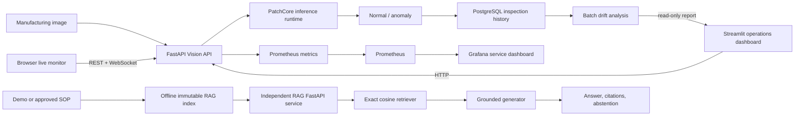
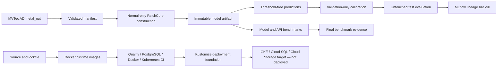

# SmartFactory AI Quality Platform

Production-oriented smart factory AI platform combining visual anomaly detection, inspection
history, experiment lineage, observability, drift analysis, an operations dashboard, and a grounded
SOP RAG assistant.

> **Status:** STEP 0–16 implementation and local/static verification complete. Actual factory data,
> production GKE/Cloud SQL deployment, and production LLM/private SOP verification remain pending.

## 1. Problem and objective

제조 이미지 모델은 정확도만으로 운영되지 않습니다. 재현 가능한 데이터 분할과 threshold, 배포 가능한 model
artifact, API와 검사 이력, 운영 metric, drift evidence, 배포 순서, 현장 SOP 근거가 함께 필요합니다.

이 저장소는 MVTec AD `metal_nut` 기반 PatchCore 이상 탐지를 중심으로 다음 lifecycle을 하나의 monorepo에
구현합니다.

- Normal-only PatchCore artifact 학습과 validation-only threshold calibration
- Image/pixel 품질 평가와 명시적 boundary를 가진 성능 benchmark
- FastAPI inference와 PostgreSQL inspection audit history
- MLflow experiment/model lineage backfill
- Docker, GitHub Actions CI, Prometheus/Grafana와 batch drift analysis
- FastAPI를 통해 inspection을 읽는 Streamlit operations dashboard
- Same-origin REST/WebSocket recovery를 갖춘 browser-native live inspection monitor
- 별도 FastAPI service로 동작하는 grounded SOP RAG와 deterministic evaluation
- Migration-gated Kubernetes/GCP deployment foundation

PatchCore는 알려진 defect class를 분류하지 않습니다. 현재 serving 결과는 `normal` 또는 `anomaly`이며,
`bent/color/flip/scratch`는 official test diagnostics이지 production defect class prediction이 아닙니다.

## 2. Key capabilities

| Area | Implemented capability |
|---|---|
| Data | MVTec 구조·이미지·mask 검증, deterministic split, manifest integrity |
| Vision | Frozen WideResNet50-2 features, PatchCore coreset memory bank, nearest-neighbor score |
| Evaluation | Validation-only threshold, fixed-threshold image/pixel metrics, per-defect diagnostics |
| Serving | Real PatchCore artifact loading, strict threshold, bounded upload, stable FastAPI errors |
| Persistence | SQLAlchemy repository, PostgreSQL/psycopg, Alembic migration, inspection history/detail |
| MLOps | MLflow run/parameter/metric/artifact lineage backfill with local SQLite verification |
| Delivery | Multi-stage Docker images, Compose lifecycle, four-job GitHub Actions CI |
| Operations | Prometheus metrics, provisioned Grafana dashboard, immutable batch drift reports |
| Dashboard | Streamlit analytics plus browser-native latest-100 real-time inspection monitoring |
| RAG | Immutable SOP index, exact cosine retrieval, grounded generation, citations and abstention |
| Deployment | Kustomize base, CPU/GPU overlays, separate migration Job and gated rollout runbook |
| Evidence | Cross-domain final benchmark with source hashes, lineage and repository provenance |

## 3. System architecture



Dashboard는 PostgreSQL에 직접 연결하지 않습니다. Grafana는 service telemetry용이며 inspection business UI가
아닙니다. Drift는 Prometheus anomaly ratio가 아니라 inspection history와 immutable reference를 비교하는 별도
batch pipeline입니다. RAG는 Vision API/PostgreSQL lifecycle과 분리된 service입니다.



Detailed boundaries are documented in [Architecture Overview](docs/architecture/overview.md).

## 4. Vision AI and data contract

MVTec AD raw data is not included in Git. Place the official dataset under
`data/raw/mvtec_ad/`; the repository stores only code, configuration and reproducibility metadata.

The internal `metal_nut` split is:

| Split | Samples | Policy |
|---|---:|---|
| Train | 198 normal | PatchCore memory bank construction only |
| Validation | 22 normal | Image/pixel threshold calibration only |
| Test good | 22 | Official test, never moved into calibration |
| Test anomaly | 93 | Official test, never used for threshold tuning |

PatchCore uses a frozen `wide_resnet50_2` feature extractor (`layer2`, `layer3`), a 10% coreset memory bank and
9-nearest-neighbor anomaly scoring. Images are resized to 256×256, center-cropped to 224×224 and ImageNet-normalized.
The test set is evaluated only after thresholds are fixed from normal validation predictions.

See [MVTec AD Pipeline](docs/data/MVTEC_AD_PIPELINE.md),
[PatchCore Baseline](docs/vision/PATCHCORE_BASELINE.md), and
[Evaluation Contract](docs/benchmarks/PATCHCORE_EVALUATION.md).

## 5. Serving and inspection data

The Vision API loads validated PatchCore artifacts once during startup. An optional YOLO segmentation singleton
serves compact known-defect instances at `/v1/known-defects` without changing the PatchCore prediction contract.
YOLO parent/child results are stored independently, recoverable through REST history/detail, and notified through the
separate best-effort `/v1/ws/known-defects` channel after commit.
The additive `/v1/combined-inspections` orchestrator decodes one upload once, runs both independent runtimes in
parallel workers, and atomically persists both child results, a recoverable correlation UUID and its decision. It
returns model observations plus a durable Decision Policy v1 `PASS`/`REJECT`/`REVIEW` result. This deterministic
model-agreement baseline is versioned and explainable, but is not production calibrated or factory certified.
Successful predictions are persisted with UUID, UTC timestamp, score, threshold, result, device and model/manifest/
threshold provenance. PostgreSQL migrations run as a separate Alembic lifecycle; application startup does not run
migrations implicitly.

The database does not persist raw inspection images. It stores bounded image metadata and SHA provenance only.
Model artifacts and thresholds are mounted read-only and delivered outside Git.

The browser-native Live Inspection Monitor is served from the Vision API at `/live/`. Separate PatchCore and YOLO
sections each open their own WebSocket before loading REST history, merge buffered events by inspection UUID, and
reload PostgreSQL-backed history after bounded reconnects. YOLO shows visible-window empty/known-defect/instance KPI,
compact class summaries and interaction-only instance lineage. The live sections do not correlate independently
created results or form a final manufacturing disposition. This view complements rather than replaces Streamlit's
analytical dashboard.

See [PatchCore API](docs/serving/PATCHCORE_API.md),
[YOLO Segmentation API](docs/serving/YOLO_SEGMENTATION_API.md),
[Combined Inspection API](docs/serving/COMBINED_INSPECTION_API.md),
[Decision Engine](docs/decision/DECISION_ENGINE.md), and
[Inspection History](docs/serving/INSPECTION_HISTORY.md).

## 6. MLOps and operations

- MLflow: project-native artifacts remain source of truth; a backfill pipeline records config, manifest, model,
  threshold, evaluation and benchmark lineage. Local SQLite round-trip is verified; remote server and Model Registry
  operation are pending.
- Monitoring: FastAPI exports bounded-cardinality HTTP, inference, persistence and prediction metrics. Prometheus
  scrapes the API and Grafana provides the service dashboard.
- Drift: validation-normal scores form an immutable reference. PostgreSQL inspection windows are compared using PSI,
  quantile shift and anomaly-ratio change. Drift does not prove accuracy degradation and does not trigger retraining.
- Dashboard: recent inspection KPI, record-level score/threshold, model lineage and latest drift report. It calls
  FastAPI for inspection data and links to Grafana for telemetry.

See [MLflow Tracking](docs/mlops/MLFLOW_TRACKING.md),
[Monitoring](docs/monitoring/MONITORING.md), [Drift](docs/monitoring/DRIFT.md), and
[Operations Dashboard](docs/dashboard/DASHBOARD.md).

## 7. SOP RAG assistant

The RAG service is provider-agnostic at the application boundary. It builds an immutable index from Markdown/TXT,
performs exact cosine retrieval over a normalized NumPy matrix, validates controlled citation IDs, and abstains before
generation when no context passes the retrieval threshold.

The tracked manuals are explicitly fictional project demo SOPs. Private factory documents, production provider
credentials and query logs are not committed. The OpenAI-compatible embedding/generation adapter is implemented, but
credentialed production-provider execution has not been verified.

Deterministic demo evaluation:

```bash
uv run python -m pipelines.build_demo_rag_evaluation_index \
  --index-id step14-demo-eval-v1

uv run python -m pipelines.evaluate_rag \
  --index-dir artifacts/rag/manuals/step14-demo-eval-v1 \
  --evaluation-id step14-demo-eval-v2
```

Production-adapter index construction requires provider model/base URL/API key configuration:

```bash
uv run python -m pipelines.build_rag_index \
  --manuals-dir manuals/demo \
  --output-root artifacts/rag/manuals \
  --index-id <index-id>
```

See [RAG Assistant](docs/rag/RAG_ASSISTANT.md) and [RAG Evaluation](docs/rag/RAG_EVALUATION.md).

## 8. Final benchmark results

STEP 15 aggregates existing historical STEP 3/4 evidence and the actual STEP 14 artifact without rerunning or tuning
the model, threshold or retriever. Results remain separated by environment and measurement boundary.

| Area | Result | Environment and boundary |
|---|---|---|
| Vision image quality | AUROC **0.997556**, F1 **0.994595** | Kaggle T4; fixed validation threshold on official test predictions |
| Pixel localization | AUROC **0.982486**, F1 **0.834279** | Kaggle T4; separate pixel threshold and localization metric |
| T4 model runtime | p50 **21.634 ms**, **45.114 images/s** | Batch 1; disk read, artifact restore, warmup, threshold excluded |
| FastAPI schema v1 | p50 **44.902 ms**, **22.030 req/s** | T4 in-process ASGI; pre-persistence; external network excluded |
| RAG retrieval | Document R@5 **1.0**, Chunk R@5 **1.0** | Fictional demo corpus; deterministic evaluation providers |
| RAG evidence | Citation P/R **0.25625/1.0**, Faithfulness **1.0** | Exact expected chunks and lexical extractive support |
| RAG correctness | Fact Recall **0.25**, Abstention **1.0** | 8 answerable and 1 unanswerable demo cases |

Citation Precision `0.25625` and Reference Fact Recall `0.25` are visible weaknesses: Top-5 coverage is high, but the
extractive baseline cites too much context and provides limited answer completeness. Faithfulness `1.0` is lexical
grounding, not production answer correctness.

The T4 model benchmark, in-process pre-persistence API benchmark, and local deterministic RAG evaluation are not one
production-environment benchmark. API schema v2 with real PostgreSQL and production-class GPU remains unmeasured.

See [Final Benchmark](docs/benchmarks/FINAL_BENCHMARK.md) and
[Metrics Contract](docs/benchmarks/METRICS_CONTRACT.md).

## 9. Repository structure

```text
apps/dashboard/       Streamlit internal operations UI
apps/live_monitor/    Same-origin HTML/CSS/JavaScript real-time inspection UI
configs/              Data, model, evaluation and benchmark evidence configuration
docs/                 Architecture, contracts, operations guides and benchmark history
examples/dashboard_demo/  Local-only synthetic inspection/drift portfolio demo
infra/k8s/            Kustomize base plus local CPU and GCP GPU overlays
manuals/demo/         Fictional public SOP corpus only
migrations/           Alembic environment and inspection schema revision
ml/                   Dataset, PatchCore, evaluation, RAG, drift and tracking logic
monitoring/           Prometheus and Grafana configuration
pipelines/            Reproducible CLI entry points
services/             Vision API, inference, persistence, monitoring, tracking and RAG services
shared/               Hashing and benchmark utilities
tests/                Unit and integration contracts
.github/workflows/    GitHub Actions CI
```

Generated `data/`, `artifacts/`, `outputs/`, `models/`, `checkpoints/`, `mlruns/`, local databases and secrets are
excluded from Git. The tracked demo SOP and RAG evaluation dataset are intentional public fixtures.

## 10. Quick start and model workflow

Requirements: Python 3.12 and [uv](https://docs.astral.sh/uv/). The universal lock selects macOS PyPI wheels,
Linux arm64 CPU wheels, or Linux x86_64 CUDA 13.0 wheels through environment markers.

```bash
uv sync --locked
make check
```

After placing MVTec AD under `data/raw/mvtec_ad/`, the executable workflow is:

```bash
# Validate data and create the deterministic manifest.
uv run python -m pipelines.prepare_mvtec_ad

# Construct the normal-only PatchCore artifact.
uv run python -m pipelines.train_patchcore \
  --artifact-id <artifact-id> \
  --device auto

# Generate validation predictions and calibrate thresholds.
uv run python -m pipelines.predict_patchcore \
  --artifact-dir artifacts/models/patchcore/<artifact-id> \
  --output-id <validation-prediction-id> \
  --split validation

uv run python -m pipelines.calibrate_patchcore_thresholds \
  --validation-predictions outputs/predictions/patchcore/<validation-prediction-id>/predictions.jsonl \
  --validation-anomaly-maps outputs/predictions/patchcore/<validation-prediction-id>/anomaly_maps.pt \
  --artifact-dir artifacts/models/patchcore/<artifact-id> \
  --output-id <threshold-id>

# Generate untouched test predictions and evaluate with stored thresholds.
uv run python -m pipelines.predict_patchcore \
  --artifact-dir artifacts/models/patchcore/<artifact-id> \
  --output-id <test-prediction-id> \
  --split test

uv run python -m pipelines.evaluate_patchcore \
  --test-predictions outputs/predictions/patchcore/<test-prediction-id>/predictions.jsonl \
  --test-anomaly-maps outputs/predictions/patchcore/<test-prediction-id>/anomaly_maps.pt \
  --thresholds outputs/evaluation/patchcore/thresholds/<threshold-id>/thresholds.json \
  --artifact-dir artifacts/models/patchcore/<artifact-id> \
  --output-id <evaluation-id>

# Benchmark model runtime without changing thresholds.
uv run python -m pipelines.benchmark_patchcore \
  --artifact-dir artifacts/models/patchcore/<artifact-id> \
  --output-id <benchmark-id> \
  --device auto
```

Full contracts and optional commands are maintained in the linked data, Vision, serving, drift, tracking, RAG and
benchmark documents rather than duplicated here.

## 11. Docker Compose

Copy the example environment and replace local placeholders, especially artifact paths and passwords:

```bash
cp .env.example .env
make docker-build
make docker-up
```

`docker-up` enforces `PostgreSQL healthy → Alembic migration complete → API start`. The Vision API does not become
ready without real compatible model and threshold artifacts mounted read-only.

Optional observers and services:

```bash
make monitoring-up
make dashboard-up
make rag-up
```

When a real local Vision API is already available, start the host Dashboard with the single official command:

```bash
make dashboard
```

For a populated local Dashboard without a model or PostgreSQL, run the explicitly synthetic demo
in two terminals:

```bash
make dashboard-demo-api
make dashboard-demo
```

The screen is labeled `DEMO — SYNTHETIC DATA`; its 100 inspection records and drift report are
deterministic visualization fixtures, not factory or benchmark evidence. See
[Operations Dashboard](docs/dashboard/DASHBOARD.md) for the local actual-service and demo boundaries.

The RAG profile also requires a compatible verified index and provider configuration. Stop services with
`make rag-down`, `make dashboard-down`, `make monitoring-down`, and `make docker-down`. `make docker-clean-volumes`
deletes persistent local volumes and must be used deliberately.

See [Docker Lifecycle](docs/deployment/DOCKER.md).

## 12. Testing and CI

```bash
uv lock --check
make check
make k8s-check
docker compose config --quiet
```

`make check` runs Ruff formatting, Ruff lint, mypy and pytest. GitHub Actions runs four jobs on pull requests and main:

1. `quality`: locked dependency sync and full quality gate
2. `postgres-integration`: Alembic plus actual PostgreSQL 17.6 contracts
3. `docker`: Compose validation and API/Dashboard/RAG Linux arm64 image builds
4. `kubernetes`: base/local CPU/GCP GPU Kustomize render

CI does not download MVTec/model artifacts or require GPU, GCP, private SOP, paid providers or production credentials.
Registry publication and production CD are not implemented.

See [CI/CD Foundation](docs/deployment/CI_CD.md).

## 13. Kubernetes and GCP foundation

The repository includes:

- Kustomize base, `local-cpu` and `gcp-gpu` overlays
- Separate, security-hardened Alembic migration Job
- FastAPI Deployment and internal ClusterIP Service
- Non-secret ConfigMap plus external Secret/PVC contracts
- Startup/liveness/readiness probes, resource baselines and non-root/read-only security contexts
- Label-gated runbook that waits for migration completion before applying API resources

The target architecture uses Artifact Registry, Cloud Storage, Cloud SQL, Secret Manager and GKE. No GCP resource,
GPU node pool, public Load Balancer or production endpoint has been created. PostgreSQL is a managed-service target,
not a Kubernetes StatefulSet. HPA remains future work until production load and accelerator capacity are measured.

See [Kubernetes/GCP Foundation](docs/deployment/KUBERNETES_GCP.md).

## 14. Documentation

| Category | Documents |
|---|---|
| Architecture | [Overview](docs/architecture/overview.md), [Project Scope](docs/PROJECT_SCOPE.md), [ADRs](docs/adr/) |
| Data / Vision | [MVTec Pipeline](docs/data/MVTEC_AD_PIPELINE.md), [PatchCore](docs/vision/PATCHCORE_BASELINE.md) |
| Serving / Data | [PatchCore API](docs/serving/PATCHCORE_API.md), [YOLO API](docs/serving/YOLO_SEGMENTATION_API.md), [Combined API](docs/serving/COMBINED_INSPECTION_API.md), [Decision Engine](docs/decision/DECISION_ENGINE.md), [Inspection History](docs/serving/INSPECTION_HISTORY.md) |
| MLOps | [MLflow](docs/mlops/MLFLOW_TRACKING.md), [Artifact Policy](docs/DATA_ARTIFACT_POLICY.md) |
| Deployment | [Docker](docs/deployment/DOCKER.md), [CI](docs/deployment/CI_CD.md), [Kubernetes/GCP](docs/deployment/KUBERNETES_GCP.md) |
| Operations | [Monitoring](docs/monitoring/MONITORING.md), [Drift](docs/monitoring/DRIFT.md), [Dashboard](docs/dashboard/DASHBOARD.md) |
| RAG | [Assistant](docs/rag/RAG_ASSISTANT.md), [Evaluation](docs/rag/RAG_EVALUATION.md) |
| Benchmarks | [Final](docs/benchmarks/FINAL_BENCHMARK.md), [Vision Evaluation](docs/benchmarks/PATCHCORE_EVALUATION.md), [T4 Runtime](docs/benchmarks/PATCHCORE_INFERENCE_BENCHMARK.md), [Metric Definitions](docs/benchmarks/METRICS_CONTRACT.md) |
| Engineering | [Coding Conventions](docs/CODING_CONVENTIONS.md) |

## 15. Limitations and pending validation

- Only the public MVTec AD `metal_nut` category is evaluated; no actual factory image or production ground truth is used.
- API schema v2 persistence-inclusive latency on a production-class GPU and real PostgreSQL remains unmeasured.
- Raw inspection images, heatmaps, overlays and defect classes are not persisted or shown in the dashboard.
- Drift monitors score distribution without production labels; ground-truth performance degradation is unavailable.
- GKE, Cloud SQL, Cloud Storage delivery, production ingress/TLS, IAP/authentication and HPA are not deployed.
- MLflow remote tracking/Registry operation is unverified.
- RAG uses fictional public SOPs and deterministic evaluation providers; private SOP and production LLM quality,
  latency, security and cost are unverified.
- Current RAG citation selection is broad and answer completeness is limited.

## 16. Future work

- Validate with approved real factory data and production ground truth.
- Run API schema v2 benchmark with real PostgreSQL and production-class GPU.
- Deploy the migration-gated stack to GKE with Cloud SQL, artifact delivery and Secret Manager.
- Add production authentication/IAP, ingress/TLS and HPA only after load testing.
- Add authenticated `wss://`, Origin validation and cross-replica event delivery before public live-monitor exposure.
- Evaluate a production embedding/generation provider and private held-out SOP corpus.
- Improve selective citations with reranking/context selection and measure the change.
- Add feature/embedding drift and a raw-image/object-storage retention policy.
- Consider a hybrid model only as future work: PatchCore for unknown anomalies plus a supervised
  classifier/detector for approved known-defect labels.

## 17. Tech stack

Python 3.12, uv, PyTorch, Torchvision, Anomalib/PatchCore, OpenCV, NumPy, scikit-learn, FastAPI,
Pydantic, SQLAlchemy, psycopg, PostgreSQL, Alembic, MLflow, Docker/Compose, GitHub Actions,
Prometheus, Grafana, Streamlit, browser-native HTML/CSS/JavaScript, Kubernetes/Kustomize, and an OpenAI-compatible
RAG adapter.

LangChain, Vector DB, Kafka, Redis, Celery and Airflow are not part of the implemented stack.

## 18. Completion status

| Step | Status | Verified scope |
|---:|---|---|
| 0 | Complete | Repository foundation, conventions and ADRs |
| 1 | Complete | Data validation, split and manifest |
| 2 | Complete | PatchCore preprocessing, memory bank and artifact |
| 3 | Complete | Threshold calibration, evaluation and T4 model benchmark |
| 4 | Complete | FastAPI serving, real-model smoke and schema v1 HTTP benchmark |
| 5 | Complete | Inspection persistence and read APIs |
| 6 | Complete | MLflow tracking/lineage with local round-trip |
| 7 | Complete | Docker/Compose and actual local PostgreSQL integration |
| 8 | Complete | GitHub Actions CI and CD-ready build foundation |
| 9 | Complete | Prometheus/Grafana application monitoring |
| 10 | Complete | Batch PatchCore score drift detection |
| 11 | Complete | Kubernetes/GCP manifest foundation; actual deployment pending |
| 12 | Complete | Internal operations dashboard; production auth pending |
| 13 | Complete | Grounded demo SOP RAG; production provider pending |
| 14 | Complete | Deterministic public-demo RAG evaluation |
| 15 | Complete | Final benchmark aggregation and clean repository provenance |
| 16 | Complete | README, architecture and repository completion audit |

“Complete” means the repository-scoped implementation and stated verification contract is complete. It does not claim
actual GCP deployment, factory-data validation, or production-provider operation.
