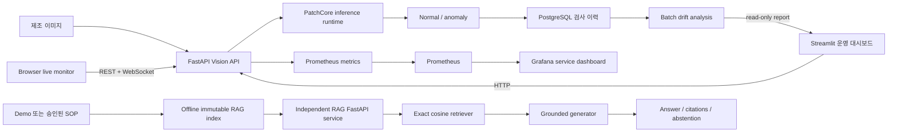
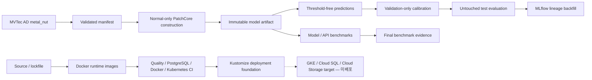

# SmartFactory AI Quality Platform

시각 이상 탐지, 검사 이력, 실험 lineage, observability, drift 분석, 운영 대시보드, 근거 기반 SOP RAG assistant를 결합한 **production-oriented 스마트팩토리 AI 품질 플랫폼**입니다.

> **상태:** STEP 0–16의 repository-scoped 구현과 local/static 검증을 완료했습니다.
>
> 실제 공장 데이터 검증, production GKE/Cloud SQL 배포, production LLM 및 private SOP 검증은 아직 수행하지 않았습니다.

## 1. 문제 정의와 목표

제조 이미지 모델은 정확도만 높다고 바로 운영할 수 없습니다. 재현 가능한 데이터 분할과 threshold, 배포 가능한 model artifact, API와 검사 이력, 운영 metric, drift evidence, 배포 절차, 현장 SOP 근거까지 함께 관리해야 합니다.

이 저장소는 MVTec AD `metal_nut` 기반 PatchCore 이상 탐지를 중심으로 다음 lifecycle을 하나의 monorepo에 구현합니다.

- Normal-only PatchCore artifact 학습과 validation-only threshold calibration
- Image/pixel 품질 평가와 명시적 boundary를 가진 성능 benchmark
- FastAPI inference와 PostgreSQL inspection audit history
- MLflow experiment/model lineage backfill
- Docker, GitHub Actions CI, Prometheus/Grafana와 batch drift analysis
- FastAPI를 통해 inspection을 조회하는 Streamlit operations dashboard
- Same-origin REST/WebSocket recovery를 갖춘 browser-native live inspection monitor
- 별도 FastAPI service로 동작하는 grounded SOP RAG와 deterministic evaluation
- Migration-gated Kubernetes/GCP deployment foundation

PatchCore는 알려진 defect class를 분류하지 않습니다. 현재 serving 결과는 `normal` 또는 `anomaly`이며, `bent/color/flip/scratch`는 official test diagnostics용 label이지 production defect class prediction이 아닙니다.

## 2. 주요 기능

| 영역 | 구현 내용 |
|---|---|
| Data | MVTec 구조·이미지·mask 검증, deterministic split, manifest integrity |
| Vision | Frozen WideResNet50-2 feature, PatchCore coreset memory bank, nearest-neighbor score |
| Evaluation | Validation-only threshold, fixed-threshold image/pixel metric, defect별 diagnostics |
| Serving | 실제 PatchCore artifact loading, strict threshold, bounded upload, 안정적인 FastAPI error contract |
| Persistence | SQLAlchemy repository, PostgreSQL/psycopg, Alembic migration, inspection history/detail |
| MLOps | MLflow run/parameter/metric/artifact lineage backfill 및 local SQLite 검증 |
| Delivery | Multi-stage Docker image, Compose lifecycle, 4-job GitHub Actions CI |
| Operations | Prometheus metric, provisioned Grafana dashboard, immutable batch drift report |
| Dashboard | Streamlit analytics와 browser-native latest-100 real-time inspection monitoring |
| RAG | Immutable SOP index, exact cosine retrieval, grounded generation, citation, abstention |
| Deployment | Kustomize base, CPU/GPU overlay, 별도 migration Job, gated rollout runbook |
| Evidence | Source hash, lineage, repository provenance를 포함한 cross-domain final benchmark |

## 3. 시스템 아키텍처



Dashboard는 PostgreSQL에 직접 연결하지 않습니다. Grafana는 service telemetry용이며 inspection business UI가 아닙니다. Drift는 Prometheus anomaly ratio가 아니라 inspection history와 immutable reference를 비교하는 별도 batch pipeline입니다. RAG는 Vision API/PostgreSQL lifecycle과 분리된 독립 service입니다.



세부 boundary는 [Architecture Overview](docs/architecture/overview.md)에 정리되어 있습니다.

## 4. Vision AI와 데이터 계약

MVTec AD raw data는 Git에 포함하지 않습니다. 공식 dataset은 `data/raw/mvtec_ad/` 아래에 배치하며, repository에는 code, configuration, reproducibility metadata만 저장합니다.

내부 `metal_nut` split은 다음과 같습니다.

| Split | Samples | 정책 |
|---|---:|---|
| Train | 198 normal | PatchCore memory bank 구성에만 사용 |
| Validation | 22 normal | Image/pixel threshold calibration에만 사용 |
| Test good | 22 | Official test, calibration에 사용하지 않음 |
| Test anomaly | 93 | Official test, threshold tuning에 사용하지 않음 |

PatchCore는 frozen `wide_resnet50_2` feature extractor의 `layer2`, `layer3` feature를 사용하고, 10% coreset memory bank와 9-nearest-neighbor anomaly scoring을 적용합니다. 이미지는 256×256 resize, 224×224 center crop, ImageNet normalization을 거칩니다.

Test set은 normal validation prediction으로 threshold를 고정한 이후에만 평가합니다.

관련 문서:

- [MVTec AD Pipeline](docs/data/MVTEC_AD_PIPELINE.md)
- [PatchCore Baseline](docs/vision/PATCHCORE_BASELINE.md)
- [Evaluation Contract](docs/benchmarks/PATCHCORE_EVALUATION.md)

### YOLO11n-seg C4 완료 상태

YOLO11n-seg C4 lifecycle은 validation-only controlled experiment, C4-3 candidate freeze, C4-4 one-time final test를 분리해 완료했습니다.

C4-3에서 C4-2C candidate selection을 종료한 뒤 threshold와 candidate를 변경하지 않고 final test를 report-only로 평가했습니다.

- Validation Mask mAP50-95: `0.4623876120`
- Final-test Mask mAP50-95: `0.4439883323`
- Strict diagnostic Recall: `0.7894736842`
- Good-negative false-positive image: `0/14`
- Final-test에서 가장 낮은 class별 Mask mAP50-95: color `0.2733855932`

이 결과로 새로운 acceptance gate, tuning 또는 candidate reselection을 만들지 않았으며 C4는 `CLOSED`입니다.

**C5 deployment optimization**에서는 frozen C4-3 candidate의 static FP32 ONNX export와
validation-only PyTorch ↔ ONNX Runtime parity를 완료했습니다. Acceptance policy v1을 characterization
이후 별도 commit으로 고정하고 exact ONNX artifact에서 prospective verification을 수행해 17개 gate를 모두
통과했으며 C5-2는 `PARITY_ACCEPTED / CLOSED` 상태입니다.

C5-3에서는 exact accepted ONNX로 Tesla T4 TensorRT FP16 engine을 build한 뒤 validation-only
PyTorch FP32 GPU ↔ TensorRT FP16 characterization을 수행했습니다. Characterization 이후
TensorRT FP16 acceptance policy v1을 별도 commit으로 고정하고, C5-3B에서 보존한 exact engine을
rebuild 없이 복원해 prospective verification을 수행했습니다.

Prospective verification에서 34개 acceptance check를 모두 통과해
`TENSORRT_FP16_PARITY_ACCEPTED`를 확인했으며 C5-3 TensorRT FP16 parity lifecycle은 `CLOSED` 상태입니다.
동일 validation measurement boundary에서 PyTorch FP32 GPU mean latency는 `31.131 ms`,
TensorRT FP16 mean latency는 `25.844 ms`, speedup ratio는 약 `1.205x`로 관측됐습니다.
C5-4A INT8 explicit-Q/DQ PTQ contract는 commit으로 고정했습니다. C5-4B1에서는 exact FP32 ONNX와 train-only calibration을 사용하는 ModelOpt Q/DQ ONNX 생성 foundation을 준비하며, TensorRT INT8 engine build와 validation characterization은 아직 실행하지 않았습니다.

자세한 C4 provenance와 quality/resource evidence는 [YOLO Experiment Log](docs/vision/YOLO_SEGMENTATION_EXPERIMENT_LOG.md),
C5 export/parity contract와 test seal은 [YOLO Deployment Optimization](docs/vision/YOLO_DEPLOYMENT_OPTIMIZATION.md)에 기록되어 있습니다.

## 5. Serving과 inspection data

Vision API는 startup 시 검증된 PatchCore artifact를 한 번 load합니다. Optional YOLO segmentation singleton은 PatchCore prediction contract를 변경하지 않고 `/v1/known-defects`에서 compact known-defect instance를 제공합니다.

YOLO parent/child result는 독립적으로 저장하며 REST history/detail로 복구할 수 있습니다. Commit 이후 별도의 best-effort `/v1/ws/known-defects` channel로 notification을 전달합니다.

추가된 `/v1/combined-inspections` orchestrator는 하나의 upload를 한 번 decode한 뒤 두 개의 독립 runtime을 parallel worker에서 실행합니다. 이후 두 child result, recoverable correlation UUID, decision을 atomic하게 persist합니다.

응답에는 model observation과 durable Decision Policy v1의 `PASS` / `REJECT` / `REVIEW` 결과가 함께 포함됩니다. 이 deterministic model-agreement baseline은 versioned·explainable하지만 production calibration이나 factory certification이 완료된 것은 아닙니다.

성공한 prediction은 UUID, UTC timestamp, score, threshold, result, device, model/manifest/threshold provenance를 PostgreSQL에 저장합니다.

PostgreSQL migration은 별도 Alembic lifecycle로 실행하며 application startup에서 migration을 암묵적으로 수행하지 않습니다.

Database에는 raw inspection image를 저장하지 않습니다. 제한된 image metadata와 SHA provenance만 저장합니다. Model artifact와 threshold는 read-only mount로 제공하며 Git 외부에서 전달합니다.

Browser-native Live Inspection Monitor는 Vision API의 `/live/`에서 제공합니다. Combined manufacturing, PatchCore, YOLO section은 각각 독립 WebSocket을 먼저 연 뒤 REST history를 load하고, buffered event를 domain UUID 기준으로 merge합니다. Bounded reconnect 이후에는 PostgreSQL-backed history를 다시 load합니다.

Combined section은 backend에 persist된 experimental Policy v1 decision만 표시하며, frontend에서 policy를 재계산하거나 독립 생성된 child result를 임의로 correlate하지 않습니다. 이 화면은 Streamlit analytical dashboard를 대체하는 것이 아니라 보완합니다.

관련 문서:

- [PatchCore API](docs/serving/PATCHCORE_API.md)
- [YOLO Segmentation API](docs/serving/YOLO_SEGMENTATION_API.md)
- [Combined Inspection API](docs/serving/COMBINED_INSPECTION_API.md)
- [Decision Engine](docs/decision/DECISION_ENGINE.md)
- [Inspection History](docs/serving/INSPECTION_HISTORY.md)

## 6. MLOps와 운영

- **MLflow**: project-native artifact를 source of truth로 유지하고 config, manifest, model, threshold, evaluation, benchmark lineage를 backfill합니다. Local SQLite round-trip은 검증했으며 remote server와 Model Registry operation은 아직 검증하지 않았습니다.
- **Monitoring**: FastAPI에서 bounded-cardinality HTTP, inference, persistence, prediction metric을 export합니다. Prometheus가 API를 scrape하고 Grafana가 service dashboard를 제공합니다.
- **Drift**: validation-normal score를 immutable reference로 사용합니다. PostgreSQL inspection window를 PSI, quantile shift, anomaly-ratio change로 비교합니다. Drift는 정확도 저하를 증명하지 않으며 자동 retraining trigger로 사용하지 않습니다.
- **Dashboard**: 최근 inspection KPI, record-level score/threshold, model lineage, 최신 drift report를 제공합니다. Inspection data는 FastAPI를 통해 읽고 telemetry는 Grafana로 연결합니다.

관련 문서:

- [MLflow Tracking](docs/mlops/MLFLOW_TRACKING.md)
- [Monitoring](docs/monitoring/MONITORING.md)
- [Drift](docs/monitoring/DRIFT.md)
- [Operations Dashboard](docs/dashboard/DASHBOARD.md)

## 7. SOP RAG assistant

RAG service는 application boundary에서 provider-agnostic하게 설계했습니다. Markdown/TXT 기반 immutable index를 생성하고, normalized NumPy matrix 위에서 exact cosine retrieval을 수행합니다. Controlled citation ID를 검증하며 retrieval threshold를 통과한 context가 없으면 generation 전에 abstain합니다.

Tracked manual은 명시적으로 fictional project demo SOP입니다. Private factory document, production provider credential, query log는 commit하지 않습니다.

OpenAI-compatible embedding/generation adapter는 구현되어 있지만 credential이 필요한 production-provider execution은 아직 검증하지 않았습니다.

Deterministic demo evaluation:

```bash
uv run python -m pipelines.build_demo_rag_evaluation_index \
  --index-id step14-demo-eval-v1

uv run python -m pipelines.evaluate_rag \
  --index-dir artifacts/rag/manuals/step14-demo-eval-v1 \
  --evaluation-id step14-demo-eval-v2
```

Production-adapter index 생성 시 provider model/base URL/API key 설정이 필요합니다.

```bash
uv run python -m pipelines.build_rag_index \
  --manuals-dir manuals/demo \
  --output-root artifacts/rag/manuals \
  --index-id <index-id>
```

관련 문서:

- [RAG Assistant](docs/rag/RAG_ASSISTANT.md)
- [RAG Evaluation](docs/rag/RAG_EVALUATION.md)

## 8. Final benchmark 결과

STEP 15는 model, threshold, retriever를 다시 실행하거나 tuning하지 않고 기존 STEP 3/4 evidence와 실제 STEP 14 artifact를 집계합니다. 서로 다른 환경과 measurement boundary의 결과를 분리해서 기록합니다.

| 영역 | 결과 | 환경 및 측정 boundary |
|---|---|---|
| Vision image quality | AUROC **0.997556**, F1 **0.994595** | Kaggle T4; fixed validation threshold로 official test prediction 평가 |
| Pixel localization | AUROC **0.982486**, F1 **0.834279** | Kaggle T4; 별도 pixel threshold와 localization metric |
| T4 model runtime | p50 **21.634 ms**, **45.114 images/s** | Batch 1; disk read, artifact restore, warmup, threshold 제외 |
| FastAPI schema v1 | p50 **44.902 ms**, **22.030 req/s** | T4 in-process ASGI; persistence 이전, external network 제외 |
| RAG retrieval | Document R@5 **1.0**, Chunk R@5 **1.0** | Fictional demo corpus, deterministic evaluation provider |
| RAG evidence | Citation P/R **0.25625/1.0**, Faithfulness **1.0** | Exact expected chunk와 lexical extractive support |
| RAG correctness | Fact Recall **0.25**, Abstention **1.0** | Answerable 8건, unanswerable 1건의 demo case |

Citation Precision `0.25625`와 Reference Fact Recall `0.25`는 현재 확인된 약점입니다. Top-5 coverage는 높지만 extractive baseline이 지나치게 많은 context를 citation하고 answer completeness가 낮습니다. Faithfulness `1.0`은 lexical grounding 지표이며 production answer correctness를 의미하지 않습니다.

T4 model benchmark, in-process pre-persistence API benchmark, local deterministic RAG evaluation은 하나의 production-environment benchmark가 아닙니다. API schema v2의 real PostgreSQL 및 production-class GPU 환경은 아직 측정하지 않았습니다.

관련 문서:

- [Final Benchmark](docs/benchmarks/FINAL_BENCHMARK.md)
- [Metrics Contract](docs/benchmarks/METRICS_CONTRACT.md)

## 9. Repository 구조

```text
apps/dashboard/           Streamlit 내부 운영 UI
apps/live_monitor/        Same-origin HTML/CSS/JavaScript 실시간 inspection UI
configs/                  Data, model, evaluation, benchmark evidence configuration
docs/                     Architecture, contract, operations guide, benchmark history
examples/dashboard_demo/  Local-only synthetic inspection/drift portfolio demo
infra/k8s/                Kustomize base, local CPU, GCP GPU overlay
manuals/demo/             Fictional public SOP corpus
migrations/               Alembic environment와 inspection schema revision
ml/                       Dataset, PatchCore, evaluation, RAG, drift, tracking logic
monitoring/               Prometheus와 Grafana configuration
pipelines/                Reproducible CLI entry point
services/                 Vision API, inference, persistence, monitoring, tracking, RAG service
shared/                   Hashing과 benchmark utility
tests/                    Unit/integration contract
.github/workflows/        GitHub Actions CI
```

생성되는 `data/`, `artifacts/`, `outputs/`, `models/`, `checkpoints/`, `mlruns/`, local database, secret은 Git에서 제외합니다. Tracked demo SOP와 RAG evaluation dataset만 의도적으로 public fixture로 유지합니다.

## 10. 빠른 시작과 model workflow

요구사항:

- Python 3.12
- [uv](https://docs.astral.sh/uv/)

Universal lock은 environment marker를 통해 macOS PyPI wheel, Linux arm64 CPU wheel, Linux x86_64 CUDA 13.0 wheel을 선택합니다.

```bash
uv sync --locked
make check
```

MVTec AD를 `data/raw/mvtec_ad/` 아래에 배치한 뒤 다음 workflow를 실행할 수 있습니다.

```bash
# Data 검증 및 deterministic manifest 생성
uv run python -m pipelines.prepare_mvtec_ad

# Normal-only PatchCore artifact 구성
uv run python -m pipelines.train_patchcore \
  --artifact-id <artifact-id> \
  --device auto

# Validation prediction 생성 및 threshold calibration
uv run python -m pipelines.predict_patchcore \
  --artifact-dir artifacts/models/patchcore/<artifact-id> \
  --output-id <validation-prediction-id> \
  --split validation

uv run python -m pipelines.calibrate_patchcore_thresholds \
  --validation-predictions outputs/predictions/patchcore/<validation-prediction-id>/predictions.jsonl \
  --validation-anomaly-maps outputs/predictions/patchcore/<validation-prediction-id>/anomaly_maps.pt \
  --artifact-dir artifacts/models/patchcore/<artifact-id> \
  --output-id <threshold-id>

# 고정된 threshold로 untouched test prediction 생성 및 평가
uv run python -m pipelines.predict_patchcore \
  --artifact-dir artifacts/models/patchcore/<artifact-id> \
  --output-id <test-prediction-id> \
  --split test

uv run python -m pipelines.evaluate_patchcore \
  --test-predictions outputs/predictions/patchcore/<test-prediction-id>/predictions.jsonl \
  --test-anomaly-maps outputs/predictions/patchcore/<test-prediction-id>/anomaly_maps.pt \
  --thresholds outputs/evaluation/patchcore/thresholds/<threshold-id>/thresholds.json \
  --artifact-dir artifacts/models/patchcore/<artifact-id> \
  --output-id <evaluation-id>

# Threshold를 변경하지 않고 model runtime benchmark
uv run python -m pipelines.benchmark_patchcore \
  --artifact-dir artifacts/models/patchcore/<artifact-id> \
  --output-id <benchmark-id> \
  --device auto
```

세부 contract와 optional command는 data, Vision, serving, drift, tracking, RAG, benchmark 문서에 유지하며 README에 중복 작성하지 않습니다.

## 11. Docker Compose

예제 환경 파일을 복사하고 artifact path와 password 등 local placeholder를 실제 값으로 교체합니다.

```bash
cp .env.example .env
make docker-build
make docker-up
```

`docker-up`은 다음 순서를 강제합니다.

```text
PostgreSQL healthy
→ Alembic migration complete
→ API start
```

Vision API는 실제 compatible model과 threshold artifact가 read-only로 mount되지 않으면 ready 상태가 되지 않습니다.

Optional observer/service:

```bash
make monitoring-up
make dashboard-up
make rag-up
```

실제 local Vision API가 이미 실행 중이면 다음 command로 host Dashboard를 시작합니다.

```bash
make dashboard
```

Model이나 PostgreSQL 없이 populated local Dashboard를 확인하려면 두 terminal에서 explicit synthetic demo를 실행합니다.

```bash
make dashboard-demo-api
make dashboard-demo
```

화면에는 `DEMO — SYNTHETIC DATA`가 표시됩니다. 100개 inspection record와 drift report는 deterministic visualization fixture이며 factory data나 benchmark evidence가 아닙니다.

RAG profile 역시 compatible verified index와 provider configuration이 필요합니다.

종료:

```bash
make rag-down
make dashboard-down
make monitoring-down
make docker-down
```

`make docker-clean-volumes`는 persistent local volume을 삭제하므로 의도적으로 실행해야 합니다.

자세한 내용은 [Docker Lifecycle](docs/deployment/DOCKER.md)을 참고합니다.

## 12. 테스트와 CI

```bash
uv lock --check
make check
make k8s-check
docker compose config --quiet
```

`make check`는 Ruff formatting, Ruff lint, mypy, pytest를 실행합니다.

GitHub Actions는 pull request와 main branch에서 다음 4개 job을 실행합니다.

1. `quality`: locked dependency sync와 full quality gate
2. `postgres-integration`: Alembic과 실제 PostgreSQL 17.6 contract
3. `docker`: Compose validation 및 API/Dashboard/RAG Linux arm64 image build
4. `kubernetes`: base/local CPU/GCP GPU Kustomize render

CI는 MVTec/model artifact를 download하지 않으며 GPU, GCP, private SOP, paid provider, production credential을 요구하지 않습니다.

Registry publication과 production CD는 아직 구현하지 않았습니다.

자세한 내용은 [CI/CD Foundation](docs/deployment/CI_CD.md)을 참고합니다.

## 13. Kubernetes와 GCP foundation

Repository에는 다음 항목이 포함되어 있습니다.

- Kustomize base, `local-cpu`, `gcp-gpu` overlay
- 별도 security-hardened Alembic migration Job
- FastAPI Deployment와 internal ClusterIP Service
- Non-secret ConfigMap과 external Secret/PVC contract
- Startup/liveness/readiness probe
- Resource baseline
- Non-root/read-only security context
- Migration 완료를 기다린 뒤 API resource를 적용하는 label-gated runbook

Target architecture는 Artifact Registry, Cloud Storage, Cloud SQL, Secret Manager, GKE를 사용합니다.

현재 실제 GCP resource, GPU node pool, public Load Balancer, production endpoint는 생성하지 않았습니다. PostgreSQL은 managed-service target이며 Kubernetes StatefulSet으로 운영하지 않습니다. HPA는 production load와 accelerator capacity를 측정한 이후의 future work입니다.

자세한 내용은 [Kubernetes/GCP Foundation](docs/deployment/KUBERNETES_GCP.md)을 참고합니다.

## 14. 문서

| 분류 | 문서 |
|---|---|
| Architecture | [Overview](docs/architecture/overview.md), [Project Scope](docs/PROJECT_SCOPE.md), [ADRs](docs/adr/) |
| Data / Vision | [MVTec Pipeline](docs/data/MVTEC_AD_PIPELINE.md), [PatchCore](docs/vision/PATCHCORE_BASELINE.md), [YOLO Segmentation](docs/vision/YOLO_SEGMENTATION_DATASET.md), [YOLO Validation Error Analysis](docs/vision/YOLO_SEGMENTATION_ERROR_ANALYSIS.md), [YOLO Experiment Log](docs/vision/YOLO_SEGMENTATION_EXPERIMENT_LOG.md), [YOLO Deployment Optimization](docs/vision/YOLO_DEPLOYMENT_OPTIMIZATION.md) |
| Serving / Data | [PatchCore API](docs/serving/PATCHCORE_API.md), [YOLO API](docs/serving/YOLO_SEGMENTATION_API.md), [Combined API](docs/serving/COMBINED_INSPECTION_API.md), [Decision Engine](docs/decision/DECISION_ENGINE.md), [Inspection History](docs/serving/INSPECTION_HISTORY.md) |
| MLOps | [MLflow](docs/mlops/MLFLOW_TRACKING.md), [Artifact Policy](docs/DATA_ARTIFACT_POLICY.md) |
| Deployment | [Docker](docs/deployment/DOCKER.md), [CI](docs/deployment/CI_CD.md), [Kubernetes/GCP](docs/deployment/KUBERNETES_GCP.md) |
| Operations | [Monitoring](docs/monitoring/MONITORING.md), [Drift](docs/monitoring/DRIFT.md), [Dashboard](docs/dashboard/DASHBOARD.md) |
| RAG | [Assistant](docs/rag/RAG_ASSISTANT.md), [Evaluation](docs/rag/RAG_EVALUATION.md) |
| Benchmarks | [Final](docs/benchmarks/FINAL_BENCHMARK.md), [Vision Evaluation](docs/benchmarks/PATCHCORE_EVALUATION.md), [T4 Runtime](docs/benchmarks/PATCHCORE_INFERENCE_BENCHMARK.md), [Metric Definitions](docs/benchmarks/METRICS_CONTRACT.md) |
| Engineering | [Coding Conventions](docs/CODING_CONVENTIONS.md) |

## 15. 한계와 미검증 범위

- Public MVTec AD `metal_nut` category만 평가했습니다. 실제 factory image나 production ground truth는 사용하지 않았습니다.
- Production-class GPU와 real PostgreSQL을 포함한 API schema v2 persistence-inclusive latency는 아직 측정하지 않았습니다.
- Raw inspection image, heatmap, overlay, defect class는 database에 persist하거나 dashboard에 표시하지 않습니다.
- Drift는 production label 없이 score distribution을 monitoring합니다. 실제 ground-truth 성능 저하는 직접 판단할 수 없습니다.
- GKE, Cloud SQL, Cloud Storage delivery, production ingress/TLS, IAP/authentication, HPA는 아직 배포하지 않았습니다.
- MLflow remote tracking 및 Registry operation은 아직 검증하지 않았습니다.
- RAG는 fictional public SOP와 deterministic evaluation provider를 사용합니다. Private SOP와 production LLM의 품질, latency, security, cost는 미검증 상태입니다.
- 현재 RAG citation selection은 넓고 answer completeness가 제한적입니다.

## 16. 향후 작업

- 승인된 실제 factory data와 production ground truth로 검증
- Real PostgreSQL과 production-class GPU 환경에서 API schema v2 benchmark
- Cloud SQL, artifact delivery, Secret Manager를 포함한 migration-gated stack의 GKE 배포
- Load testing 이후 production authentication/IAP, ingress/TLS, HPA 추가
- Public live-monitor 노출 전 authenticated `wss://`, Origin validation, cross-replica event delivery 구현
- Production embedding/generation provider와 private held-out SOP corpus 평가
- Reranking/context selection을 통한 selective citation 개선 및 재측정
- Feature/embedding drift와 raw-image/object-storage retention policy 추가
- PatchCore를 unknown anomaly에, supervised classifier/detector를 승인된 known-defect label에 사용하는 hybrid model 검토

## 17. 기술 스택

Python 3.12, uv, PyTorch, Torchvision, Anomalib/PatchCore, OpenCV, NumPy, scikit-learn, FastAPI, Pydantic, SQLAlchemy, psycopg, PostgreSQL, Alembic, MLflow, Docker/Compose, GitHub Actions, Prometheus, Grafana, Streamlit, browser-native HTML/CSS/JavaScript, Kubernetes/Kustomize, OpenAI-compatible RAG adapter를 사용합니다.

LangChain, Vector DB, Kafka, Redis, Celery, Airflow는 현재 구현된 stack에 포함되지 않습니다.

## 18. 완료 상태

| Step | 상태 | 검증 범위 |
|---:|---|---|
| 0 | Complete | Repository foundation, convention, ADR |
| 1 | Complete | Data validation, split, manifest |
| 2 | Complete | PatchCore preprocessing, memory bank, artifact |
| 3 | Complete | Threshold calibration, evaluation, T4 model benchmark |
| 4 | Complete | FastAPI serving, real-model smoke, schema v1 HTTP benchmark |
| 5 | Complete | Inspection persistence와 read API |
| 6 | Complete | MLflow tracking/lineage와 local round-trip |
| 7 | Complete | Docker/Compose와 실제 local PostgreSQL integration |
| 8 | Complete | GitHub Actions CI와 CD-ready build foundation |
| 9 | Complete | Prometheus/Grafana application monitoring |
| 10 | Complete | Batch PatchCore score drift detection |
| 11 | Complete | Kubernetes/GCP manifest foundation; 실제 deployment는 pending |
| 12 | Complete | Internal operations dashboard; production auth는 pending |
| 13 | Complete | Grounded demo SOP RAG; production provider는 pending |
| 14 | Complete | Deterministic public-demo RAG evaluation |
| 15 | Complete | Final benchmark aggregation과 clean repository provenance |
| 16 | Complete | README, architecture, repository completion audit |

여기서 `Complete`는 repository-scoped implementation과 명시된 verification contract가 완료되었다는 의미입니다. 실제 GCP deployment, factory-data validation, production-provider operation까지 완료되었다는 의미는 아닙니다.
