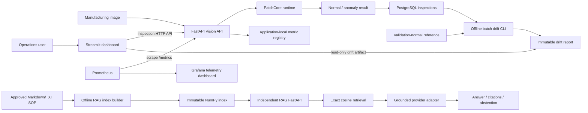
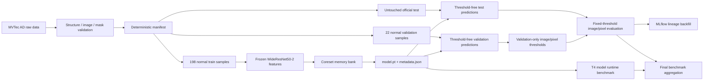
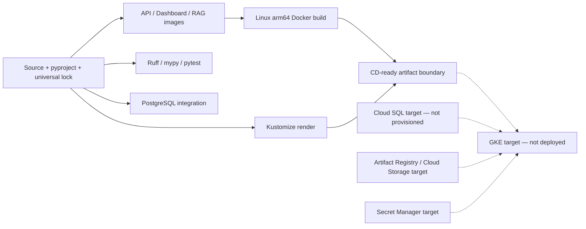

# SmartFactory AI Quality Platform — Architecture Overview

## 1. 현재 architecture와 검증 경계

이 문서는 STEP 16 완료 시점의 실제 구현을 설명한다. 시스템은 Vision inspection, offline ML lifecycle,
operations, SOP RAG와 deployment foundation으로 나뉜다. GKE/Cloud SQL/production LLM은 target architecture이며
실제 배포 또는 credentialed production verification을 완료한 구성요소가 아니다.

Monorepo 안에서 code와 contract를 공유하지만 runtime 책임은 다음처럼 분리한다.

- Vision API: PatchCore inference, threshold 판정, inspection persistence와 metrics
- Dashboard: FastAPI inspection client와 immutable drift report reader
- RAG API: immutable index, retrieval, grounded generation과 citations
- Offline pipelines: data preparation, training, evaluation, benchmark, MLflow backfill과 drift analysis
- Deployment foundation: Docker/Compose와 Kustomize manifests/runbook

## 2. Runtime system architecture



### Responsibility boundaries

- Dashboard는 SQLAlchemy session이나 PostgreSQL credential을 갖지 않고 inspection data를 FastAPI로만 읽는다.
- Grafana는 HTTP/inference/persistence telemetry를 표시하며 inspection history business UI가 아니다.
- Drift는 Prometheus series를 재해석하지 않는다. PostgreSQL inspection window와 immutable reference의 score
  distribution을 batch로 비교한다.
- RAG API는 Vision API, inspection database와 startup dependency가 없는 별도 process/port다.
- Vision API는 model artifact나 threshold가 없으면 ready가 되지 않으며 production fake switch가 없다.

## 3. Vision data and model lifecycle



Manifest가 sample identity/split의 source of truth다. Official test sample을 calibration으로 이동하거나 test metric을
보고 threshold를 변경하지 않는다. PatchCore는 frozen features와 normal memory bank의 nearest-neighbor distance로
unknown anomaly를 찾으며 supervised defect classifier가 아니다.

Artifact는 immutable ID directory에 저장되고 overwrite를 거부한다. `model.pt`, metadata, manifest, threshold,
prediction/evaluation/benchmark artifact는 SHA lineage로 연결한다. Generated artifact와 raw data는 Git 밖에서
delivery하며, configuration과 compact historical evidence만 version control한다.

## 4. Serving and persistence lifecycle

Vision request boundary:

```text
multipart upload
  → bounded read and image decode
  → preprocessing and device transfer
  → PatchCore inference
  → strict score > threshold decision
  → PostgreSQL INSERT/COMMIT
  → validated response
```

`/health`는 process liveness, `/ready`는 model load, database connectivity와 migrated schema readiness를 구분한다.
Alembic migration은 application startup이나 init container가 아니라 별도 lifecycle이다.

Compose는 `PostgreSQL healthy → migration complete → API start`를 dependency condition으로 강제한다. Kubernetes
runbook은 configuration 적용, external Secret/PVC 확인, migration Job apply/wait, API apply와 rollout 확인 순서를
label selector로 강제한다.

PostgreSQL에는 prediction result와 lineage를 저장하지만 raw inspection image는 저장하지 않는다. Raw image/object
storage는 retention, access control과 lifecycle 요구가 확정된 뒤 별도 설계한다.

## 5. MLOps, monitoring and drift

MLflow adapter는 project-native artifact를 대체하지 않는다. 검증된 config, manifest, model, threshold, evaluation과
benchmark를 하나의 tracking run으로 backfill한다. Local SQLite metadata/artifact store round-trip은 검증됐지만
remote tracking server와 Model Registry 운영은 미검증이다.

Monitoring과 drift는 다른 질문에 답한다.

| Capability | Input | Output | 의미 |
|---|---|---|---|
| Prometheus/Grafana | Live API counters/histograms | Service telemetry | 요청률, latency, error, persistence/inference 상태 |
| Drift pipeline | Validation reference + inspection history | Immutable drift JSON | Score population 변화와 operational status |
| Dashboard | FastAPI history + drift JSON | Human-readable operations view | 최근 prediction, KPI, lineage와 drift evidence |

Drift status는 ground-truth accuracy degradation이 아니며 retraining/promotion을 자동 실행하지 않는다.

## 6. RAG architecture

RAG ingestion과 online query를 분리한다.

```text
Markdown/TXT corpus
  → normalized document identity and SHA
  → deterministic section-aware chunking
  → provider-identified embeddings
  → immutable metadata/chunks/float32 matrix

Question
  → query embedding
  → exact cosine top-k and minimum score
  → controlled context IDs
  → grounded generator
  → marker/citation allow-list validation
  → answer or insufficient_context
```

Small current corpus에는 Vector DB를 사용하지 않는다. Retrieval abstraction은 유지하지만 pgvector/ANN은 measured
scale need가 생겼을 때만 검토한다. Question/manual은 untrusted data이며 generated citation metadata를 신뢰하지 않고
application이 실제 retrieved chunks에서 구성한다.

Tracked corpus와 STEP 14 evaluation은 fictional public demo다. OpenAI-compatible HTTP adapter는 구현됐지만 private
SOP와 credentialed production embedding/generation/judge는 검증하지 않았다.

## 7. Build, CI and deployment foundation



GitHub Actions jobs are `quality`, `postgres-integration`, `docker`, and `kubernetes`. They do not require MVTec data,
model artifacts, GPU, GCP, private SOP or paid provider credentials. Registry publication, environment approval, OIDC and
production CD are future work.

Kubernetes base includes a migration Job, API Deployment and ClusterIP Service only. PostgreSQL StatefulSet,
LoadBalancer, HPA, Dashboard/RAG workloads and monitoring stack are intentionally absent. GCP target uses managed Cloud
SQL and external artifact/secret delivery; no GCP resource has been created.

## 8. Configuration and security boundaries

- `pyproject.toml` and `uv.lock` select macOS, Linux arm64 CPU or Linux x86_64 cu130 PyTorch artifacts by marker.
- Non-secret settings use YAML/ConfigMap/environment variables; credentials remain in `.env`, Compose runtime values or
  external Kubernetes Secrets.
- Runtime images use non-root users, read-only root filesystems where configured, dropped capabilities and read-only
  model/index mounts.
- Production APIs/Dashboard/RAG require private networking, authentication/IAP or gateway, TLS, authorization, rate
  limits and audit policy before public exposure.
- Actual private SOP, raw factory image, provider payload/error and credentials are not committed or logged as evidence.

## 9. Verified and pending state

Verified within the stated environments:

- Data leakage and artifact integrity contracts
- Kaggle T4 PatchCore quality, model runtime and real-model FastAPI smoke/schema v1 benchmark
- Local Docker PostgreSQL migration/persistence integration
- Local MLflow SQLite round-trip
- API/Dashboard/RAG container builds and smoke contracts
- GitHub Actions quality/PostgreSQL/Docker/Kubernetes job definitions and main CI history
- Prometheus/Grafana configuration, drift pipeline, dashboard and deterministic demo RAG evaluation
- Kustomize base/CPU/GPU rendering and migration-gated deployment order

Pending production verification:

- Actual factory dataset and labels
- Persistence-inclusive schema v2 API benchmark on production-class GPU and real PostgreSQL
- GKE GPU, Cloud SQL, Cloud Storage/Artifact Registry and Secret Manager deployment
- Production ingress/TLS, authentication/IAP, HPA and load/rollback exercise
- Remote MLflow/Registry operation
- Private SOP, production embedding/generation/judge quality, latency, security and cost

The [README](../../README.md) is the completion entry point. Detailed contracts are indexed there and historical STEP
3/4 benchmark documents remain unchanged as measurement records.
